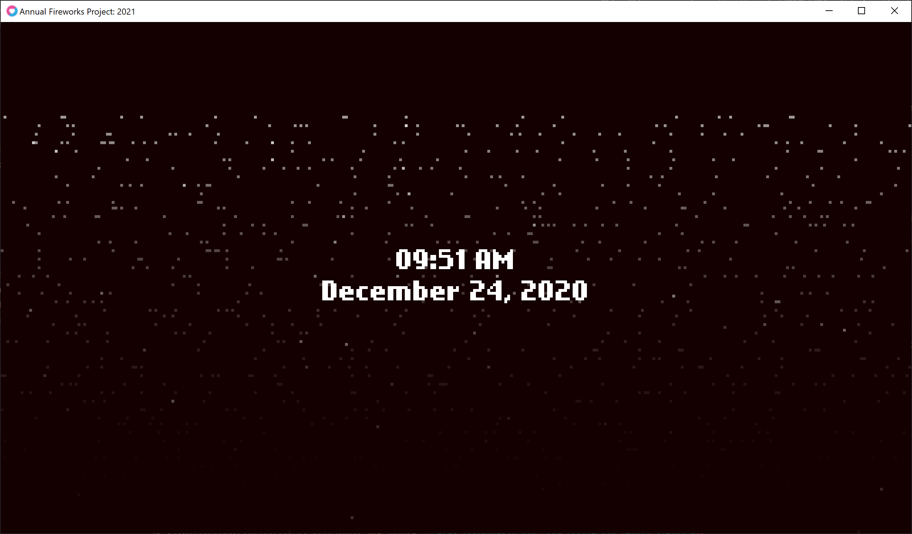

# Happy New Year! 2021



Back for another new year's. This follows the same premise as last year's, but I've "adapted" it to Lua (using love2d) and gone for a more modern (compared to last year's) aesthetic.

This will be streamed over New Year's in NZDT (UTC+13) before I head out to have fun with my friends.

I'll be hosting this year's one on [my YouTube channel](https://www.youtube.com/watch?v=n2MLLPqJyl4). You can also keep tabs on [the Twitter thread](https://twitter.com/thegreatrazz/status/1341834042820313088).

## Running

This is written in Lua using the [LÖVE](https://love2d.org/) framework. Run it by dragging the folder onto the LÖVE icon, or running:

```
$ love .
```

## Full Screen

Left-click on the window to bring it to full-screen. Left-click again to exit. 

> **Known Issue:** On exiting full screen, you may notice the window being misshaped, resize it to restore scale.

## Calibration Mode

The date for New Year's (NZDT) is hard-coded in [main.lua](main.lua#L5), but you can change it easily. For testing, you can use `os.time() + 70` instead of the timestamp.

The timestamp can be changed by entering calibration mode (right-click on window) and changing `DATE_TARGET` to whatever timestamp you want. The timestamp is represented as the date and time on the local system below. 

For the use as a stream, a `DATE_OFFSET` can also be set to shift the time by any number of seconds.

To exit calibration mode, right-click again.
